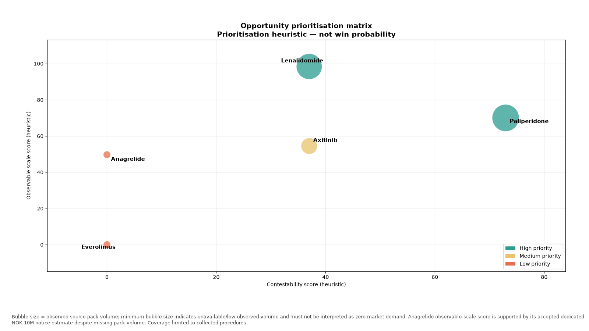
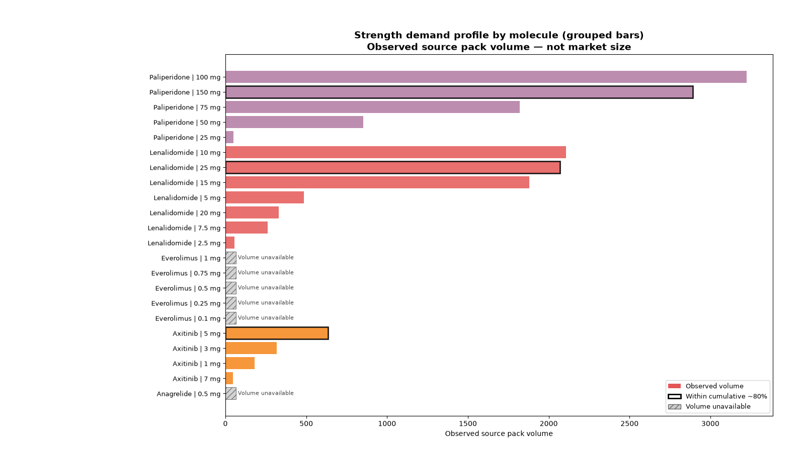
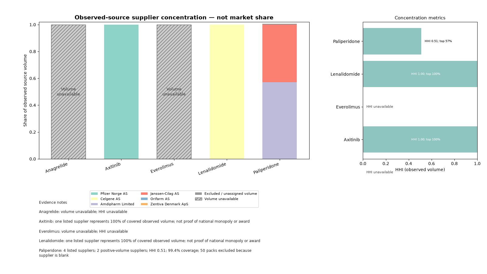
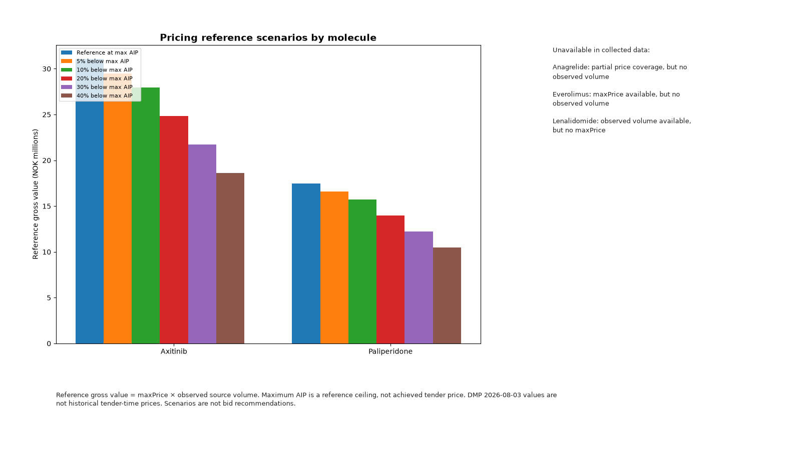
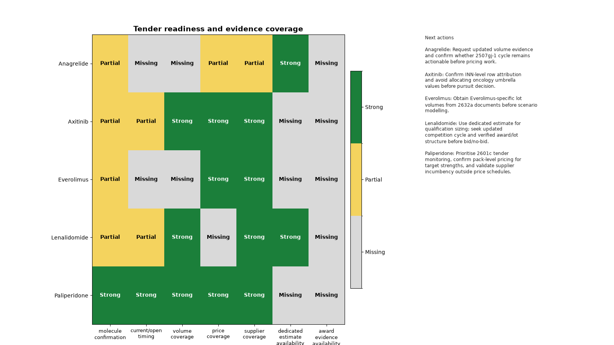

# Norwegian Pharmaceutical Tender Pipeline

## Executive summary

This project builds an evidence-based pipeline for Norwegian hospital pharmaceutical procurement across five target molecules: **Paliperidone, Lenalidomide, Axitinib, Anagrelide, and Everolimus**. The pipeline discovers relevant tenders on TED, collects Sykehusinnkjøp procurement documents, extracts pack-level rows from Excel schedules, filters by molecule and ATC evidence, normalises fields, enriches maximum prices, and validates provenance before producing a canonical dataset and static commercial analytics.

The final accepted dataset contains **41 pack rows** across **six procedures** and **five molecules**, drawn from collected tender documents — not the complete Norwegian market.

**Primary opportunity: Paliperidone** — open 2601c competition, strong observed volume, multi-supplier price schedules, and favourable timing.

**Secondary opportunity: Lenalidomide** — large accepted dedicated notice estimate (NOK 320 million) and documented pack demand, but weaker current pricing evidence and historical procedure timing.

The most important limitation is **incomplete source coverage**: missing volume, unverified awards, umbrella notice values, and Mercell access-controlled downloads mean many fields remain blank by design rather than imputed.

---

## Business questions

The project investigates:

- Which target molecules appear in relevant Norwegian tenders?
- Which products, strengths, packs, and suppliers are listed in collected documents?
- What price and historical-volume evidence is available per pack?
- Which opportunities appear most commercially relevant given evidence quality and timing?
- What additional information is required before a bid decision?

---

## Scope and final coverage

| Molecule | Pack rows | Observed source volume |
|----------|----------:|-----------------------:|
| Paliperidone | 18 | 8,841 |
| Lenalidomide | 7 | 7,188 |
| Axitinib | 4 | 1,175 |
| Anagrelide | 6 | Unavailable |
| Everolimus | 6 | Unavailable |
| **Total** | **41** | **17,204** |

Additional scope facts:

- **28** output columns
- **6** distinct procedures (notice IDs)
- **5** molecules
- **26** of 41 rows with a defensible maximum-price reference (63.4%)

**Volume semantics:** missing volume does not mean zero demand; explicit source zeros are preserved as zero; unavailable values remain blank.

---

## Data sources

### TED

Used for tender discovery, notice identifiers, publication dates, procedure metadata, estimated contract values, and lifecycle notices (PIN, competition, award, VEAT). Nine official notice XML files are included under `data/cache/ted_xml/` for the offline build; TED search discovery caches are refreshed separately online.

### Mercell

Used for procurement landing pages, document discovery, and tender attachment links. Some direct attachment URLs were access-controlled; those documents were downloaded manually and stored as local seed files under `data/seeds/`.

### Sykehusinnkjøp documents

Price schedules (prisskjema), requirement specifications (kravspesifikasjon), product and pack listings, supplier names, historical pack sales, and tender-specific maximum AIP values.

### DMP maximum-price workbook

**Direktoratet for medisinske produkter** — workbook effective **2026-08-03**. Used only for exact validated item-number matches. Tender-document maximum AIP takes priority. DMP values are **current administrative references**, not historical tender-time prices.

---

## Pipeline process

```text
TED and Mercell discovery
            ↓
Document collection and validation
            ↓
Excel/PDF extraction
            ↓
Molecule and ATC filtering
            ↓
Cleaning and normalisation
            ↓
Price and notice enrichment
            ↓
Validation and provenance audit
            ↓
output.csv and static analytics
```

### Discovery

Search terms include English molecule name, Norwegian spelling, ATC code, relevant brand names, LIS/tender reference, and buyer name (`Sykehusinnkjøp HF`). Candidates are reviewed before document collection.

### Document validation

Extension and file-signature checks, workbook readability, PDF text availability, SHA-256 fingerprints, source inventory, and manual candidate review (`data/discovery/`).

### Extraction

Workbooks use different layouts; header rows and column names vary. Dedicated molecule tenders are simpler; umbrella and multi-molecule tenders require row-level filtering.

### Molecule matching

Evidence hierarchy:

1. Molecule name and ATC in row
2. Molecule name in document
3. Validated ATC in document
4. Brand plus validated ATC
5. Uncertain or unrelated rows rejected

**Axitinib:** accepted using ATC L01EK01 and Inlyta brand evidence; explicit Axitinib INN text was absent from accepted source rows; evidence confidence remains limited.

### Cleaning and normalisation

Consistent molecule names, standard strengths, cleaned pack sizes, supplier placeholders removed, notice codes mapped to readable values, explicit zero preserved, missing values preserved, one consistent 28-column schema.

### Price enrichment

1. Tender-document `Maks AIP` first
2. Otherwise exact validated DMP maximum AIP
3. Otherwise blank
4. Offered GIP never mapped to maximum price

| Price source | Rows |
|--------------|-----:|
| Tender document | 19 |
| DMP current reference | 7 |
| Missing / unavailable | 15 |
| **Total** | **41** |

### Notice lifecycle and values

PIN, competition, revision, and award notices can belong to the same procurement. Lifecycle notices are linked to prevent pack-row duplication. `estimatedValue` is a notice-level field repeated on every pack row for that notice — deduplicate by `noticeId` before aggregation and never sum it across pack rows. Dedicated molecule estimates are accepted; umbrella or multi-molecule totals are rejected. Historical turnover is not treated as a contract estimate. Listed supplier is not treated as awarded supplier.

**Accepted dedicated estimates:**

- Lenalidomide: NOK 320 million
- Anagrelide: NOK 10 million

**Rejected examples:**

- Axitinib: NOK 3.2 billion oncology umbrella value
- Everolimus: NOK 128 million combined Everolimus/mycophenolic value
- Paliperidone: NOK 14.67 million seven-medicine VEAT value

---

## Final output

**[`data/processed/output.csv`](data/processed/output.csv)**

- One row per accepted pack/procedure combination
- UTF-8 CSV, **41 rows**, **28 columns**
- All five molecules present
- Blank values mean unavailable, inapplicable, or rejected
- Provenance stored separately in audit files

| Audit file | Purpose |
|------------|---------|
| [`data/processed/pack_evidence.csv`](data/processed/pack_evidence.csv) | Pack-level evidence trail |
| [`data/processed/row_filter_audit.csv`](data/processed/row_filter_audit.csv) | Accepted and rejected rows |
| [`data/processed/dmp_price_join_audit.csv`](data/processed/dmp_price_join_audit.csv) | Maximum-price join outcomes |
| [`data/processed/notice_value_audit.csv`](data/processed/notice_value_audit.csv) | Accepted and rejected notice values |
| [`data/processed/lifecycle_linkage.csv`](data/processed/lifecycle_linkage.csv) | Procedure lifecycle links |

---

## Key findings by molecule

### Paliperidone

- 18 pack rows across two procurement cycles (LIS 2301d VEAT and open **2601c**)
- 8,841 observed source packs
- Four listed suppliers; two with positive observed volume (Amdipharm, Janssen-Cilag); two with explicit zero (Orifarm, Zentiva)
- HHI approximately **0.51** on covered supplier volume; **99.4%** concentration coverage
- **Primary opportunity** — listed supplier does not mean award winner

### Lenalidomide

- 7 pack rows; 7,188 observed packs
- Accepted dedicated estimate **NOK 320 million** (notice-level)
- One listed supplier (Celgene AS) in collected schedule
- Historical LIS 2234 procedure; no defensible maximum-price coverage in accepted pack rows
- **Secondary opportunity**

### Axitinib

- 4 pack rows; 1,175 observed packs
- Maximum-price coverage through DMP current reference (four strengths)
- ATC/brand-based identification (L01EK01 / Inlyta); oncology umbrella estimate rejected

### Anagrelide

- 6 pack rows; three listed suppliers (Bluefish, Sandoz, Takeda)
- Accepted dedicated estimate **NOK 10 million**
- Observed volume unavailable in collected documents

### Everolimus

- 6 pack rows; one listed supplier (Novartis Norge AS)
- Maximum prices available from tender document
- Source volume unavailable; multi-molecule contract estimate rejected

---

## Opportunity prioritisation

| Rank | Molecule | Score | Band |
|------|----------|------:|------|
| 1 | Paliperidone | 79.97 | High |
| 2 | Lenalidomide | 67.77 | High |
| 3 | Axitinib | 47.25 | Medium |
| 4 | Anagrelide | 32.45 | Low |
| 5 | Everolimus | 29.08 | Low |

Heuristic weights: observable scale **30%**, contestability **25%**, portfolio breadth **20%**, timing **15%**, evidence quality **10%**.

> **This is a prioritisation heuristic — not a win probability, not a financial forecast.** Missing evidence lowers readiness but is not interpreted as zero market demand.

---

## Recommendation

### Primary: Paliperidone

- Monitor the active **2601c** procedure
- Focus initially on high-volume strengths (100 mg and 150 mg account for ~70% of observed volume)
- Verify actual incumbency and awards outside price schedules
- Evaluate competitive pricing below maximum AIP
- Investigate whether zero-volume listed suppliers represent inactive listings or credible future competitors

### Secondary: Lenalidomide

- Obtain current price evidence
- Search for a newer procurement cycle
- Verify whether apparent supplier concentration is genuine
- Treat NOK 320 million as notice-level sizing, not pack-level allocation

### Watchlist

- **Axitinib:** confirm explicit molecule attribution and dedicated value
- **Anagrelide:** obtain observed volume
- **Everolimus:** obtain volume and molecule-specific value
- **All five:** obtain verified award outcomes

---

## Additional commercial insights

### Evidence-adjusted opportunity

A large notice estimate alone does not make an opportunity immediately actionable. Paliperidone combines open timing, multi-supplier schedules, and observed volume. Lenalidomide has high scale but weaker current pricing and timing evidence.

### Listed versus effective competition

Paliperidone lists four suppliers but only two show positive observed volume; two show explicit zero. This distinguishes listed competition from observed supplier activity. Explicit zero is not proof that a supplier cannot compete in future cycles.

### Data gaps create a research plan

| Molecule | Main evidence gap | Next research action |
|----------|-------------------|----------------------|
| Paliperidone | Verified awards/incumbency | Confirm award and incumbent evidence |
| Lenalidomide | Current price evidence | Obtain tender-time or current pack pricing |
| Axitinib | Explicit INN and dedicated value | Confirm molecule-specific tender evidence |
| Anagrelide | Observed volume | Obtain pack-sales evidence |
| Everolimus | Volume and molecule-specific estimate | Obtain lot-level evidence |

### Maximum price is not a bid price

Maximum AIP provides a reference ceiling and supports mechanical discount scenarios. It does not determine a competitive tender bid.

### Strength concentration

From `reports/tables/strength_demand.csv` (molecules with observed volume only):

**Paliperidone** (8,841 packs): 100 mg **36.5%**, 150 mg **32.7%**, 75 mg **20.6%**, 50 mg **9.7%**, 25 mg **0.6%** — demand is concentrated in depot injection strengths 75–150 mg.

**Lenalidomide** (7,188 packs): 10 mg **29.3%**, 25 mg **28.8%**, 15 mg **26.2%** — top three strengths account for **84.3%** of observed volume.

**Axitinib** (1,175 packs): 5 mg **54.0%**, 3 mg **26.9%**, 1 mg **15.2%**, 7 mg **3.9%** — mid/high strengths dominate.

### Data-quality insight

Missing fields are commercially meaningful: they identify where further research has the highest value before bid/no-bid decisions.

---

## Static visualisations

### 1. Opportunity priority



Ranks molecules by the Phase 6 heuristic score; Paliperidone leads on timing and contestability.

*Limitation: scores are not win probabilities.*

### 2. Strength demand



Shows observed volume concentration by strength for molecules with volume coverage.

*Limitation: Anagrelide and Everolimus excluded — volume unavailable.*

### 3. Supplier concentration



Displays observed-source supplier shares where volume coverage exists.

*Limitation: listed supplier ≠ award winner; missing supplier volume excluded from denominator.*

### 4. Pricing scenarios



Mechanical maximum-AIP discount scenarios for packs with price references.

*Limitation: reference scenarios only — not bid recommendations.*

### 5. Tender readiness



Summarises evidence completeness dimensions per molecule.

*Limitation: readiness reflects collected documents, not national market completeness.*

---

## Reproducibility

```bash
python -m venv .venv
source .venv/bin/activate
pip install -e ".[dev]"
python -m norway_tenders.cli build --offline
python -m norway_tenders.cli analyse
pytest
```

- `build --offline` rebuilds `output.csv` from collected seed documents and the included minimal TED XML cache (no network required)
- `analyse` regenerates analytical tables in `reports/tables/` and static charts in `reports/charts/`
- `discover` refreshes TED search results online (network required; separate from the offline build)
- Mercell document downloads may require manual access for protected attachments

---

## Repository structure

```text
config/                    Molecule configuration
data/seeds/                Collected source documents
data/cache/ted_xml/        Minimal cached official TED notice XML (required for offline build)
data/discovery/            Discovery and review audits
data/processed/            Final output and provenance audits
reports/charts/            Static PNG/SVG charts
reports/tables/            Analytical tables
src/norway_tenders/        Python pipeline
tests/                     Automated tests
docs/                      Methodology and reference documentation
```

The repository includes nine cached TED notice XML files under `data/cache/ted_xml/` so `build --offline` runs deterministically without network access. Discovery search caches under `data/cache/ted_search/` are not submitted and can be refreshed separately with `discover` when online.

---

## Limitations

- Incomplete Norwegian market coverage — only collected procedures are represented
- Mercell access-control boundary; some attachments require manual download
- Small dataset (41 pack rows) limits statistical confidence
- No verified award outcomes; `awardedValue` and `awardedSupplier` are blank
- Listed supplier is not award winner
- Mixed volume period definitions across source documents
- DMP prices (2026-08-03) are current references, not tender-time prices
- Umbrella and multi-molecule notice values rejected
- Axitinib accepted using ATC/brand evidence without explicit INN in pack rows
- Anagrelide and Everolimus volume unavailable in collected documents
- Opportunity score is a prioritisation heuristic, not a forecast
- Pricing scenarios are mechanical references, not bid recommendations

---

## Further documentation

- [Methodology](docs/methodology.md)
- [Data dictionary](docs/data_dictionary.md)
- [Decision log](docs/decision_log.md)
